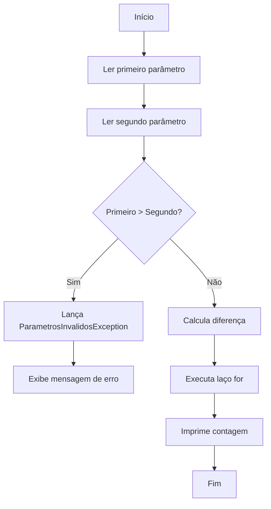

#  Desafio de Controle de Fluxo

##  Sobre o Projeto

Este projeto foi desenvolvido como um exercício prático da trilha de **Java Básico**, com o objetivo de consolidar os conceitos de:

- Estruturas de controle de fluxo;
- Laços de repetição (`for`);
- Tratamento de exceções;
- Criação de exceções personalizadas em Java.

O sistema recebe **dois números inteiros** através do terminal. A partir desses valores, calcula a quantidade de interações necessárias e realiza uma contagem progressiva no console.

Caso a regra de negócio seja violada — ou seja, se o **primeiro número for maior que o segundo** — o fluxo é interrompido por uma exceção personalizada.

---

##  Funcionalidades

-  Leitura de dois números inteiros via terminal.
-  Validação dos parâmetros informados.
-  Lançamento de exceção personalizada (`ParametrosInvalidosException`).
-  Contagem progressiva utilizando o laço `for`.
-  Tratamento de erros com `try-catch`.

---

##  Regra de Negócio

> O **primeiro parâmetro deve ser menor ou igual ao segundo parâmetro**.

Se essa condição não for atendida, o programa interrompe a execução e exibe a seguinte mensagem:

```text
O segundo parâmetro deve ser maior que o primeiro
```

---

##  Fluxo de Funcionamento



---

## Exemplos de Execução

| Primeiro Parâmetro | Segundo Parâmetro | Comportamento | Resultado |
|-------------------:|------------------:|---------------|-----------|
| 12 | 30 |  Sucesso | Imprime do número **1 ao 18** |
| 30 | 12 |  Erro | `O segundo parâmetro deve ser maior que o primeiro` |

---

##  Exemplo de Execução

### Entrada

```text
Digite o primeiro parâmetro:
12

Digite o segundo parâmetro:
30
```

### Saída

```text
Imprimindo o número 1
Imprimindo o número 2
Imprimindo o número 3
...
Imprimindo o número 18
```

---

##  Estrutura do Projeto

```text
src/
├── Contador.java
└── ParametrosInvalidosException.java
```

### 📌 `Contador.java`

Responsável por:

- Conter o método `main()`;
- Ler os parâmetros utilizando `Scanner`;
- Tratar exceções com `try-catch`;
- Implementar o método:

```java
contar(int parametroUm, int parametroDois)
```

---

### `ParametrosInvalidosException.java`

Classe de exceção personalizada responsável por representar a violação da regra de negócio.

```java
public class ParametrosInvalidosException extends Exception {

    public ParametrosInvalidosException(String mensagem) {
        super(mensagem);
    }

}
```

---

##  Como Executar

### 1. Acesse a pasta do projeto

```bash
cd caminho/para/o/projeto/src
```

### 2. Compile os arquivos

```bash
javac Contador.java ParametrosInvalidosException.java
```

### 3. Execute a aplicação

```bash
java Contador
```

---

##  Conceitos Praticados

Durante o desenvolvimento deste projeto foram aplicados os seguintes conceitos:

- Entrada de dados com `Scanner`;
- Estruturas condicionais (`if`);
- Laços de repetição (`for`);
- Tratamento de exceções (`try-catch`);
- Criação de exceções personalizadas;
- Uso de `throw` e `throws`;
- Organização de responsabilidades entre classes;
- Boas práticas na validação de regras de negócio.

---

##  Tecnologias

- Java
- JDK 17+ (ou superior)
- Terminal / Prompt de Comando

---

##  Objetivo

Este desafio faz parte da trilha de **Java Básico** da **DIO (Digital Innovation One)** e tem como objetivo praticar conceitos fundamentais da linguagem Java, especialmente controle de fluxo e tratamento de exceções.

---

## Autor
Eduardo Gomes Cardoso
Desenvolvido como parte dos desafios práticos da **DIO** para aprimorar conhecimentos em Java.
